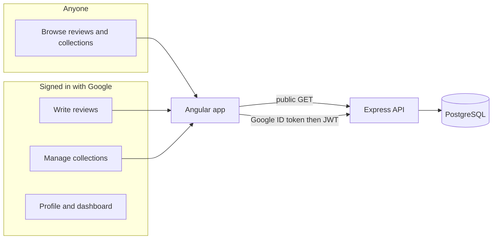

# Food Blog

A food review and collection site: browse public reviews and curated lists, sign in with Google to write reviews and manage your own collections.

This folder is the **Angular frontend** (`food-blog-client`). The REST API lives in a sibling folder, **`food-blog-api`** (Express + Prisma + PostgreSQL). The Angular SSR server in `src/server.ts` only hosts the app—it does not implement business APIs.

## Architecture



| Piece | Role |
| ----- | ---- |
| `food-blog-client` | Angular 21, Tailwind 4, SSR via Express (host only) |
| `food-blog-api` | Auth, reviews, collections, users (planned) |
| PostgreSQL | Persistent data via Prisma |

For the full feature list, API contract, and implementation status, see **[PROJECT.md](./PROJECT.md)**. For release history, see **[CHANGELOG.md](./CHANGELOG.md)**.

## Prerequisites

- **Node.js** 20+
- **npm** (project uses npm 11+)
- **PostgreSQL** (when running the API)—local Docker is documented in `food-blog-api/README.md` once that project exists
- **Google Cloud** OAuth 2.0 Web client (for sign-in, when auth ships)

## Quick start (client only)

From this directory:

```bash
npm install
npm start
```

Open [http://localhost:4200/](http://localhost:4200/). The app hot-reloads on source changes.

Other useful scripts:

| Command | Purpose |
| ------- | ------- |
| `npm run build` | Production build → `dist/` |
| `npm run serve:ssr:food-blog` | Run SSR build (after `npm run build`) |
| `npm test` | Unit tests (Vitest via Angular CLI) |

## Full stack (client + API)

When `food-blog-api` is initialized (see [PROJECT.md](./PROJECT.md)):

1. Start PostgreSQL (example one-liner, from repo root or API README):

   ```bash
   docker run --name food-blog-db -e POSTGRES_PASSWORD=postgres -e POSTGRES_DB=foodblog -p 5432:5432 -d postgres:16
   ```

2. In `food-blog-api/`: copy `.env.example` to `.env`, run migrations, then `npm run dev` (default API base: `http://localhost:3000/api`).

3. In `food-blog-client/`: set environment values (see below), then `npm start`.

The client calls the API over HTTP (`HttpClient`); it does not mount API routes on Angular’s SSR `server.ts`.

## Environment variables

### Client (`food-blog-client`)

Planned in Angular environment files (e.g. `src/environments/environment.ts`):

| Variable | Description |
| -------- | ----------- |
| `googleClientId` | Google OAuth Web client ID (same app as API) |
| `apiBaseUrl` | API root, e.g. `http://localhost:3000/api` |

### API (`food-blog-api`)

Documented in that project’s `.env.example` (not committed):

| Variable | Description |
| -------- | ----------- |
| `DATABASE_URL` | PostgreSQL connection string |
| `GOOGLE_CLIENT_ID` | Verify Google ID tokens |
| `JWT_SECRET` | Sign session JWTs |
| `CORS_ORIGIN` | Allowed browser origin, e.g. `http://localhost:4200` |

Never commit `.env` files.

## Planned routes (frontend)

| Path | Purpose | Auth |
| ---- | ------- | ---- |
| `/` | Home feed (latest public reviews) | — |
| `/reviews/:id` | Review detail | — |
| `/reviews/new`, `/reviews/:id/edit` | Create / edit own review | Yes |
| `/collections/:id` | Collection detail (if public) | — |
| `/collections/new` | New collection | Yes |
| `/users/:id` | Public profile | — |
| `/me` | My reviews and collections | Yes |

## Documentation standard

- Non-trivial source files: file-level comment describing responsibility
- Exported APIs: JSDoc (params, returns, side effects)
- After each feature: update `CHANGELOG.md` and checkboxes in `PROJECT.md`

## Repo layout

```
food-blog/
├── food-blog-client/   # this app
├── food-blog-api/      # Express API (separate package)
└── (optional) docker-compose.yml for Postgres
```

## Additional resources

- [Angular CLI](https://angular.dev/tools/cli)
- [PROJECT.md](./PROJECT.md) — vision, personas, feature checklist, API notes
- [CHANGELOG.md](./CHANGELOG.md) — versioned change log
